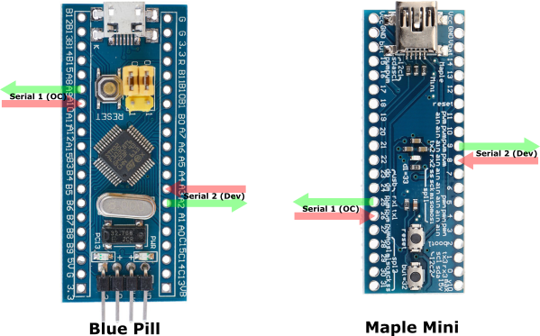
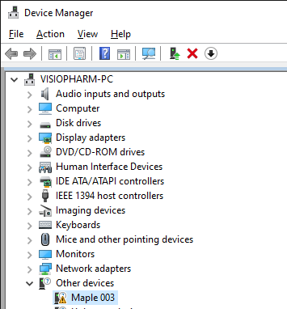
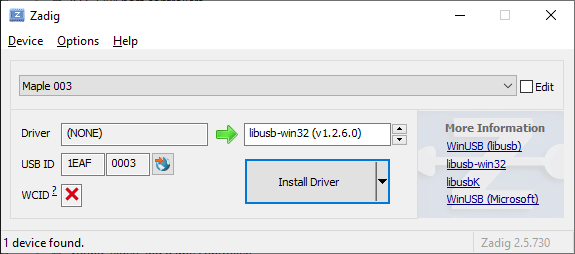
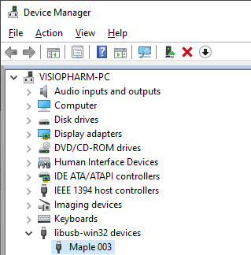

# The Y-Pipe project
A hardware device (STM32duino based) for spying on RS232 communications.

## Introduction
The Y-Pipe is a device that replaces the RS232 link between the *original controller* and the *device*, and can be used for injecting commands from a
second *substitute controller* while simultaneously logging traffic between all three machines.

With an RDP connection from the Substitute Controller to the Original Controller (e.g. with an Ethernet cable between the two machines and a shared local network), all the reverse engineering work can be done from a single screen / keyboard / mouse.

## Hardware
So far, the Y-Pipe has been tested on the [Blue Pill](https://stm32duinoforum.com/forum/wiki_subdomain/index_title_Blue_Pill.html) and on the [Maple Mini](https://stm32duinoforum.com/forum/wiki_subdomain/index_title_Maple_Mini.html). Both of these are STM32F103 based devices.

The reason for using a STM32F103 based device is the fabulous [USBComposite_stm32f1 library](https://github.com/arpruss/USBComposite_stm32f1) which is part of the [Arduino_STM32](https://github.com/rogerclarkmelbourne/Arduino_STM32) ) library and allows the microcontroller
board to be seen as two separate USB serial devices on the substitute controller, one to inject commands and one for logging all the traffic.

As to which one is the better option, that's a tricky question. The Maple bootloader needs to access the main serial port to switch to DFU mode, which may not be available if the connection is being used. This isn't an issue when programming the Blue pill with an STLink. The Maple Mini is thinner and the choice between Micro-USB and Mini-USB is a matter of choice.

RS232 communication from the device and to the original controller is handled through any kind of [MAX3232 clone module](https://www.sparkfun.com/products/11189) as long as the sockets and plugs match. 
Ultimately, it doesn't matter how this is wired as long as (most likely case), DCE goes to the PC and DTE goes to the device (see https://components101.com/connectors/rs232-connector).

[Electrically isolated modules](https://www.aliexpress.com/wholesale?SearchText=RS232+232+to+TTL+power+isolation) do exist and should be used to prevent ground loops and protect the original equipment.

# Use case scenarios
## Logging traffic between original controller (RS232) and device (RS232)
This could be used to spy on the traffic being exchanged between the controller and device.
This is especially important when the original controller is an older machine or possibly something else entirely and all you can tap into is the original RS232 link.

## Logging USB to Serial traffic
On the Y-Pipe, the substitute controller link (USB) is completely symmetrical and can be used to simultaneously send commands to the device and on the same machine,
log the traffic that comes back. For example, you want to reverse engineer an illumination device with an RS232 port and the control software works fine on a modern
machine using a USB to RS232 adapter. In this case, the Y-Pipe *replaces* the adapter and gives you a second serial port to log the traffic.

## Command injection / mutation
This may require some programming, but it is possible to replace substrings on the fly, from any of the controllers or from the device.
This is useful when either the original controller or the device sends strings which make the original controller misbehave.
Another use is when the controller was designed with a different device from the one you have and maybe changing the identification string sent back by the device unlocks
the controller software.

## Faking a device
The commented code in fakeResponse(String rxMsg) is there to completely fake a Hamilton MVP device which will register with Micro-Manager's HamiltonMVP device adapter. rxMsg comes from either USB1, USB2 or the serial controller. In the fakeResponse() function, the response is stored in the global variable rxMsg2 String, and by setting the global flag isFaked to true, the Y-Pipe then behaves as if it got a message from the Serial Device. This is super handy to quickly simulate a device you may not have access to.

## Comparing the original software traffic to that of an alternative stack
Through the Y-Pipe and **using a lot of caution**, it is possible to control the device using two software stacks simultaneously and compare the responses sent back by the device. Original, Substitute and Device traffic is labelled as such through the logging port.

## Two separate applications on the same computer controlling a single device
This uses the 3rd USB device (a &Psi;-Pipe rather than a Y-Pipe) and makes sense when the chosen control software (Micro-Manager, Metamorph, ...) only provides some basic level of integration, but the manufacturer of the device has a much more compelling bit of software. Unfortunately in most cases (unless the device has a USB and RS232 port that can be used simultaneously), you can only use one at a time. All the software is here to build a USB to RS232 widget which provides control from both applications independently, because two separate USB serial ports (plus one of the console) are provided. The console is connected to the top-most serial port, and is used to select RS232 baud-rate and delimiter (see below).

# Compilation
The Y-Pipe software relies on Roger Clarke's Arduino_STM32 core libraries and can easily be compiled and uploaded via the Arduino IDE. Very briefly, install the Arduino SAM boards (Cortex-M3) and clone the [Arduino_STM32 repository](https://github.com/rogerclarkmelbourne/Arduino_STM32) into your Arduino/hardware folder. Full instructions in the [Arduino_STM32 wiki](https://github.com/rogerclarkmelbourne/Arduino_STM32/wiki/Installation).

For the maple mini, the best way I found to upload via the bootloader is to first install a libusb-win32 device. To do this, put the maple mini in "perpetual bootloader mode" (press reset, press the other button when fast blinking, should continue to fast blink).

At this point, if the maple mini appears as an unknown device in other devices:

You can use [Zadig](https://zadig.akeo.ie/) to install a generic libusb driver for when you need to talk to the maple mini in bootloader mode:

... after which this is what the Maple003 device looks like in the Device manager:

Other than that, everything needed to compile Y-Pipe should be already installed and compilation and upload (via the Bootloader) can be done in the Arduino IDE.

# Usage
At any time, comments can be typed in the console window. These can be used to describe *in plain text* what the command issued was, causing the serial instructions that follow. There is a length limit before the comment simply continues to the next line. Also, if some serial traffic occurs while typing a comment, the comment will be truncated gracefully.

The *interactive* console mode is entered by pressing ENTER on an empty line. This stops the logging of traffic from the controllers and device, until console mode is exited by typing 'x'.

A few things can be changed and saved in the Y-Pipe EEPROM memory:
* 'b' typed on its own in the console displays the current baud rate between controller and device. b+BAUDRATE (e.g. 'b115200') changes the baud rate. Valid options are 1200, 2400, 4800, 9600, 19200, 38400, 57600 and 115200.
* 'm' on its own shows the current serial mode (number of data bits, stop bits, parity odd/even/none), 'm?' shows the modes available, one of (for an STM32F103) 8N1 8N2 9N1 9N2 8E1 8E2 8O1 8O2 7E1 7O1
* 'd' on its own displays the current delimiter value. d plus a delimiter string sets the delimiter. '\\r', '\\n' and '\\xHH' within the string are understood. **d\\r**, **d\\n** and **d\\r\\n** are probably the most useful, but to monitor the Lumencor Spectra traffic for example, you will want to issue the command **d\x50** which will set the delimiter to the ASCII character 0x50 (hex).

Additional commands are:
* 'H' for help
* 'W' for who am I? which displays each role on the corresponding terminal window (if connected)
* Simply press \[ENTER\] to return to logging mode.

# Limitations
The 7 bit mode is a bit of a hack. Only ASCII values between 0 and 127 are transmitted to and from the device. I've only tested 8N1 and 7O1 for now. More testing required.